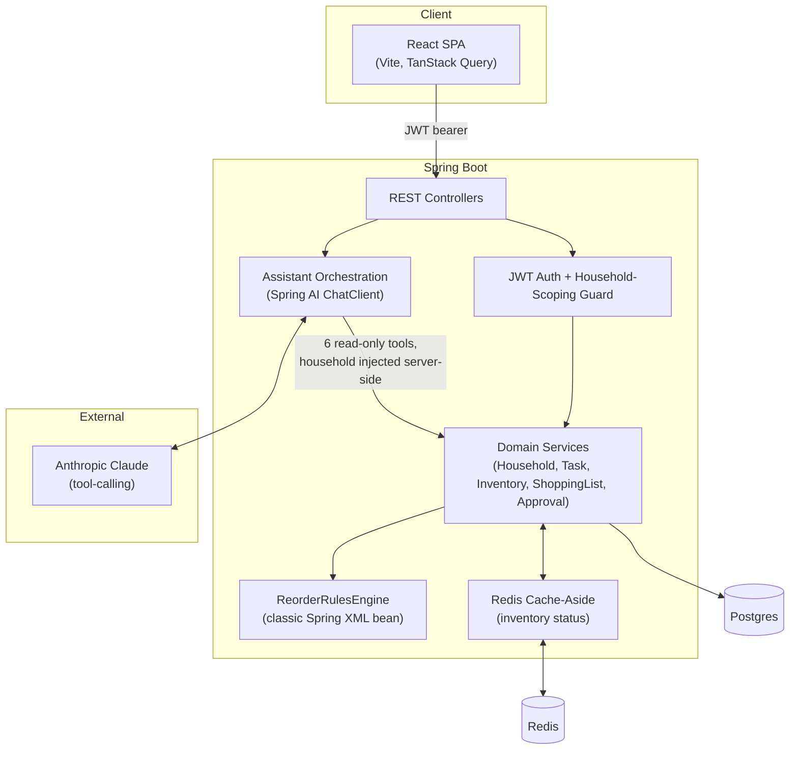

# Household Ops

A household operations assistant  — fills the gap between arrival-readiness checklists and the ongoing, day-to-day churn of running a household: what's low on stock, who's doing what, and what needs the owner's sign-off before it happens.

I made a little live demo on video check it out! https://youtu.be/h1L99WgEAqc

## Why this project

This was built as a portfolio project while taking inspiration from a company that builds family-office software . Their public product materials cover two things well: checklists/maintenance tracking for getting a property guest-ready, and a family of conversational assistants that answer natural-language questions over structured data ("what capital calls are due this week?").

What's missing from that picture is the boring, constant stuff: the pantry running low, an errand that needs assigning to a specific staff member, a repair that costs more than the household's casual-spend threshold and needs the owner to actually say yes. This project is that fifth assistant — modeled deliberately on the shape of the other two patterns already in place there:

- **Approval flow** mirrors a "threshold spend needs the principal's sign-off" pattern: tasks and shopping-list items over a household's configured threshold automatically raise an approval request against that household's specific principal, and can't be marked complete until it's decided.
- **The assistant** answers natural-language questions the same way a "capital calls due this week" query would need to work — grounded in live structured data via tool-calling, not a document search.

## Architecture



## Things worth noticing

- **One bean is deliberately wired via classic Spring XML**, not `@Component`: `ReorderRulesEngine`'s implementation (`legacy/reorder-rules-context.xml` + `@ImportResource`) — modeling how a stable, rarely-touched business-rules component might persist in a long-lived enterprise codebase rather than being migrated to annotations for its own sake. It still participates fully in the Boot context (autowirable, runs on a `@Scheduled` job) once loaded.
- **Redis backs a real cache-aside**, not a decorative one: the inventory low-stock aggregation is the most-read, moderately expensive computed view in the system (hit by the dashboard and by the assistant's inventory tool on nearly every query), invalidated explicitly on writes via `@CacheEvict`. Getting this right in practice surfaced a genuine bug — see below.
- **The assistant uses tool-calling over six fixed, read-only queries, not RAG.** The household a query is scoped to always comes from the authenticated caller's JWT, server-side — the model never supplies or chooses it, so there's no path for a prompt to leak another household's data.
- **JWT auth with 4 roles** (Owner/Principal, House Manager, Staff, Vendor) mapped to real family-office personas, with household-scoping enforced as an explicit guard clause rather than left implicit, and approval decisions additionally require being the *specific* assigned principal — not just any Owner.
- **Multi-property support is additive, not a retrofit.** An Owner overseeing more than one household (a real family-office shape) is modeled as a separate `HouseholdAccessGrant` table plus its own read-only `/portfolio` endpoint, rather than changing what "household-scoped" means everywhere else. The JWT filter re-derives a caller's household from their own staff record on every request, and that single-household assumption is load-bearing across every existing controller — reworking it this late to support a household *list* would have meant touching every one of those call sites for one feature. The grant table gets the product value (a cross-property summary) without putting the existing, tested authorization model at risk.


## Tech stack


| Layer    | Choice                                                                    |
| ---------- | --------------------------------------------------------------------------- |
| Backend  | Java 17, Spring Boot 3.5, Spring Data JPA, Spring Security, Flyway        |
| Database | PostgreSQL 16                                                             |
| Cache    | Redis 7                                                                   |
| Auth     | JWT (jjwt), BCrypt                                                        |
| AI       | Spring AI 1.0 + Anthropic Claude (tool-calling)                           |
| Frontend | React 19, TypeScript, Vite, Tailwind CSS v4, TanStack Query, React Router |
| API docs | springdoc-openapi / Swagger UI                                            |

## Running it

### One command (Docker)

```bash
docker compose up --build
```

Brings up Postgres, Redis, and the app (backend + bundled frontend) on **http://localhost:8090**. Demo data seeds automatically on first boot.

To enable the assistant page, export `ANTHROPIC_API_KEY` before running — everything else works without it (the assistant endpoint returns a clean error if the key isn't set).

### Local development (faster iteration)

```bash
docker compose up postgres redis   # just the infra
cd backend && ./mvnw spring-boot:run   # API on :8090
cd frontend && npm install && npm run dev   # UI on :5173, proxies /api to :8090
```

### Demo credentials

Seeded automatically; password is `password123` for all:


| Role          | Email                    |
| --------------- | -------------------------- |
| Owner         | owner@householdops.dev   |
| House Manager | manager@householdops.dev |
| Staff         | staff@householdops.dev   |
| Vendor        | vendor@householdops.dev  |

The login page has one-click buttons for each.


